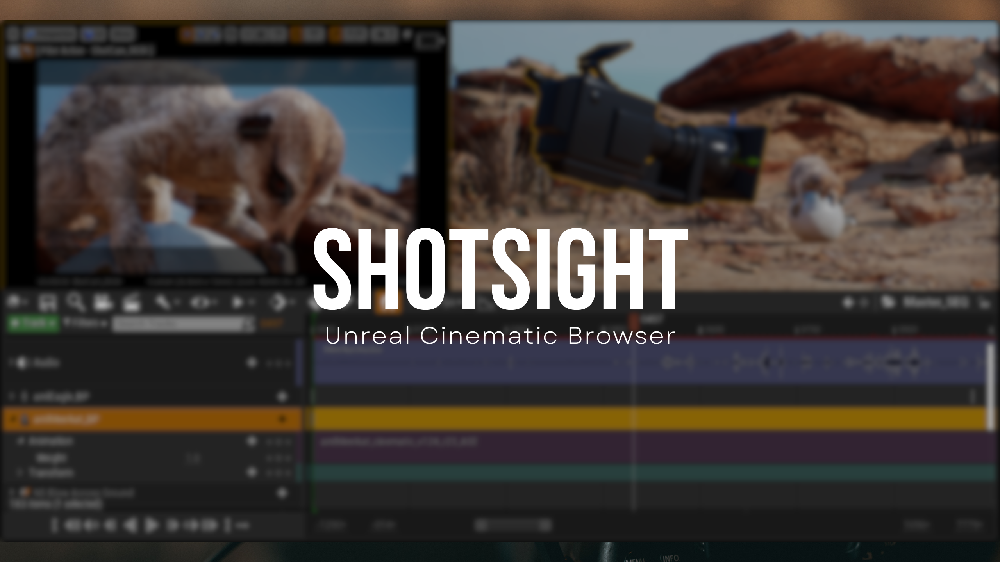

# 

 </a>

## Description

#### ShotSight - Streamlined Sequence Management for Unreal Engine
Simplify your cinematic workflow with ShotSight, the essential tool that brings all your sequence information into one intuitive window. This powerful plugin revolutionizes how you manage and monitor your Unreal Engine sequences through its comprehensive live listing system.

| Feature                     | Description                                                                                                |
|-----------------------------|------------------------------------------------------------------------------------------------------------|
| Real-time Sequence Overview | Monitor crucial metrics including FPS, length, nested sequences, audio status, and camera cuts at a glance |
| Consolidated Interface      | Access all sequence-related information in a single, organized window                                      |
| Live Listing System         | Keep track of multiple sequences simultaneously with dynamic updates                                       |
| Quick Access Controls       | Open and refresh sequences directly from the interface                                                     |
| Visual Preview Thumbnails   | Easily identify sequences with thumbnail previews                                                          |
| Directory Management        | Efficiently organize and locate your sequence files                                                        |
|Transaction Undo             | Feel safe knowing                                                       |
Perfect for:                  | Cinematic designers / Game developers / Animation teams / Virtual production artists / Level sequence creators

ShotSight streamlines your production pipeline by eliminating the need to navigate multiple windows and menus. Whether you're managing complex cinematics or simple sequences, this tool provides the visibility and control you need to work more efficiently.

## Getting Started

### Installing

This plugin is a self contained Unreal Engine 5.4 plugin (For 5.5 please see the release at the top of the page. Place the **Entire** folder into either your Project/Plugins folder (if Plugins does not exist you can create it) or place it in your engine installation directory under Engine/Plugins

### Loading the interface

* Open your Unreal Engine project
* Go to Edit > Plugins and search for ShotSight. Enabling the plugin once you find it and restarting the editor.
* Navigate to the secondary editor toolbar and find the ShotSight  button (Hovering over this helpfully tells you "Open ShotSight Cinematic Browser.)

## Feature Roadmap

> The tool roadmap for version 1.1 and beyond

🚀 &nbsp;**OPEN** &nbsp;&nbsp;📉 &nbsp;&nbsp;**0 / 1** goals completed **(0%)** &nbsp;&nbsp;📅 &nbsp;&nbsp;**Mon Jun 30 2025**

| Status | Feature | Labels 
| :---: | :--- | --- | 
| ❌ | Persistant user settings after closing the window or restarting the editor |`in progress`| 
| ❌ | Filter by sequence types "Master Sequences, Camera Animations, Template Animations etc. |`queued`| 

## Authors

Scott Rafferty

scott@pyre-labs.com

## Version History

* v1.0
    * Initial Release

## License

This project is licensed under [MIT](LICENSE.md).

